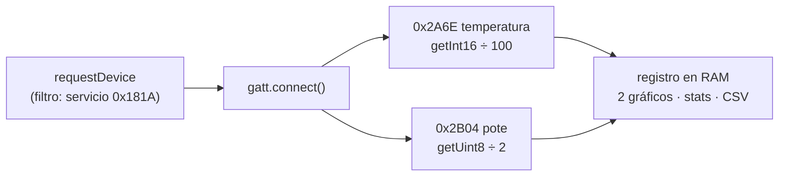

# 01 — Logger BLE (Web Bluetooth)

El ESP32 publica **dos canales** por **Bluetooth Low Energy** — la
temperatura del DS18B20 y la posición de un potenciómetro — y la app web se
conecta directo desde **Chrome/Edge** con Web Bluetooth: sin drivers, sin
app instalada, sin emparejamiento. El navegador es el registrador.

## 📖 Un poco de teoría

- **BLE no es el Bluetooth "de los auriculares"**: es un protocolo pensado
  para sensores — el periférico **anuncia** su existencia (advertising) y
  expone sus datos en una base de datos jerárquica llamada **GATT**:
  *servicios* que agrupan *características*. Acá usamos UUIDs **estándar**
  del Bluetooth SIG: el servicio *Environmental Sensing* (`0x181A`) con una
  característica por canal — *Temperature* (`0x2A6E`) y *Percentage 8*
  (`0x2B04`). Cualquier app del mundo que conozca la especificación entiende
  a nuestro sensor sin leer nuestro código: interoperabilidad por
  especificación. Y **agregar un canal = agregar una característica** — la
  estructura escala sin tocar el protocolo.
- **Notify**: en vez de que el cliente pregunte, el sensor **empuja** el
  valor nuevo a quien se haya suscripto (el descriptor CCCD habilita la
  suscripción). Compararlo con el polling del proyecto 02.
- **El dato viaja binario**: la spec de `0x2A6E` dice *sint16,
  little-endian, en centésimas de °C* (`24,31 °C → 2431 → 0x7F 0x09`: dos
  bytes contra los ~6 del texto `"24.31\n"`); la de `0x2B04` dice *uint8 en
  pasos de 0,5 %* (`57,5 % → 115 → 0x73`: un solo byte). El precio: sin la
  especificación, esos bytes no significan nada.
- **Web Bluetooth** corre solo en contexto seguro (**HTTPS** — por eso la
  app vive en GitHub Pages), requiere un gesto del usuario (el botón
  *Conectar*) y el usuario elige el dispositivo en un diálogo del navegador:
  la página nunca ve lo que no le mostraste. Disponible en Chrome/Edge de
  PC y Android; **no existe en iOS/Safari** — buen tema: estándar propuesto
  vs. adopción real.

## 🔌 Hardware

| Componente | Pin | Notas |
|------------|-----|-------|
| DS18B20 (DATA) | GPIO 4 | pull-up de 4,7 kΩ entre DATA y 3V3 |
| DS18B20 (VDD/GND) | 3V3 / GND | el mismo sensor del curso de IoT |
| Potenciómetro (extremos) | 3V3 y GND | ~10 kΩ, como divisor resistivo |
| Potenciómetro (cursor) | GPIO 34 (ESP32) · GPIO 3 (C3) | pin de **ADC1** (con la radio encendida ADC2 no funciona) — el firmware elige el pin según la placa |

<picture>
  <source media="(prefers-color-scheme: dark)" srcset="../docs/img/circuito-logger-dark.svg">
  
</picture>

## Lado ESP32 — `esp32_ble/`

1. Abrir el proyecto con PlatformIO (o el `workspace.code-workspace` de la
   raíz) y cambiar `NOMBRE_BLE` por el del grupo (`EL831-G3`): en el aula
   va a haber varios anunciando a la vez.
2. Compilar y subir. La pila BLE es grande: el `platformio.ini` ya trae
   `board_build.partitions = huge_app.csv` para que entre.
3. El Serial Monitor muestra las mismas mediciones, como testigo
   (`temp_c, pote_pct`).
4. Con `SIMULAR = true` no hace falta ningún sensor.

## Lado app — `docs/` (GitHub Pages)

Uso: abrir la app → **Conectar por Bluetooth** → elegir el dispositivo del
grupo → el registro arranca solo. **Descargar CSV** exporta todo lo
registrado; `?demo=1` muestra la interfaz sin hardware.

La app es una **PWA instalable**: ícono ⊕ en la barra de direcciones (PC) o
menú ⋮ → *Instalar app* (Android). Ícono propio, ventana propia, y gracias
al service worker (`docs/sw.js`) abre aun sin internet — el Bluetooth es
local, así que el logger instalado funciona completo sin red.

El pote notifica primero y la temperatura después: la app guarda el par
completo al llegar la temperatura (mirá `conectar()` en la página).

La página es un solo archivo HTML sin dependencias — leerla es parte del
ejercicio: el bloque `conectar()` tiene 20 líneas y es todo el protocolo.

## 🗣️ Qué discutir

- **BLE es de a uno**: con un grupo conectado, el vecino no encuentra el
  dispositivo (dejó de anunciar). ¿Por qué? ¿Qué cambia con WiFi (proyecto 02)?
- **El timestamp lo pone el navegador** al llegar la notificación: el
  espaciado entre muestras no es exactamente 1 s. ¿De dónde sale ese jitter?
- **Girar el pote de punta a punta** mirando el gráfico: ¿llega a 0 y a
  100 %? El extremo alto satura antes (el ADC del ESP32 llega a ~3,1 V con
  atenuación de 11 dB) — un error de fondo de escala de manual.
- **¿Cómo detectarías una muestra perdida** si no hay `seq`? (proponer y
  probar: agregar un contador a la característica — rompe la spec de
  `0x2A6E`; ¿dónde lo pondrías?).

## ⚠️ Errores típicos

- **"Web Bluetooth no está disponible"**: la página está en `http://` (no
  HTTPS), o es iPhone/Safari. En Linux puede requerir habilitar Bluetooth
  en el navegador.
- **No aparece el dispositivo en el diálogo**: ya hay otro cliente
  conectado (BLE es 1 a 1), el ESP32 está sin alimentación, o el Bluetooth
  de la PC está apagado.
- **Se desconecta al alejarse**: alcance BLE ~10 m; la app lo marca en rojo
  y el botón *Conectar* se rehabilita.
- **El binario no cierra**: ¿leíste el `sint16` como little-endian? Probar
  a mano: `0x7F 0x09` → `0x097F` = 2431 → 24,31 °C.
- **`Pin 34 is not ADC pin!` en el monitor y el pote clavado en 0**: la
  placa es una C3 — en el C3 el GPIO 34 no existe. El firmware actual elige
  GPIO 3 automáticamente (`#ifdef CONFIG_IDF_TARGET_ESP32C3`): actualizar y
  recablear el cursor a GPIO 3.

## 📜 Apéndice

[`Slides_Apendice_Bluetooth.pdf`](Slides_Apendice_Bluetooth.pdf) — la
historia del Bluetooth: del rey Harald Blåtand y la patente de Hedy Lamarr
al BLE, GATT y Web Bluetooth que usa este logger. Cada pieza del protocolo
tiene fecha y motivo — conocer la historia es saber por qué es como es.
