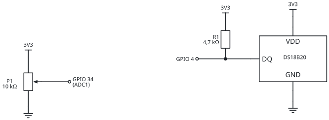
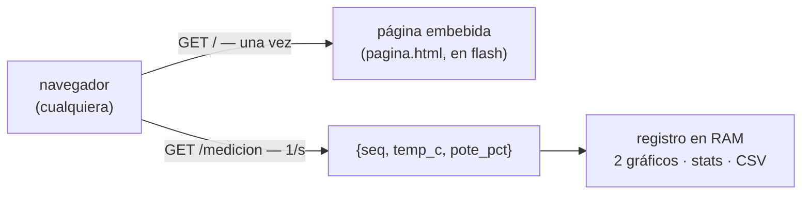

# 02 — Logger WiFi (el instrumento es el servidor)

El ESP32 **crea su propia red WiFi** (modo Access Point) y **sirve la app
de registro** en `http://192.168.4.1`, con los mismos **dos canales** del
proyecto 01 (temperatura del DS18B20 + posición del potenciómetro). No
depende de la red del laboratorio, de internet ni de ningún servidor: se
enchufa el ESP32, uno se conecta a su red y el logger aparece en el
navegador — cualquier navegador, celular incluido.

## 📖 Un poco de teoría

- **Modo AP vs. modo estación**: hasta ahora el ESP32 se colgaba de una red
  existente (STA). En modo **Access Point** el instrumento ES la red:
  publica un SSID, da direcciones por DHCP y vive en `192.168.4.1`. Es la
  arquitectura de los instrumentos de campo configurables por WiFi.
- **¿Por qué la app no está en GitHub Pages acá?** Porque una página HTTPS
  tiene prohibido hacer `fetch` a un `http://192.168.x.x` (*mixed
  content*). La solución elegante es que **el instrumento sirva su propia
  interfaz**: página y datos salen del mismo origen y el problema
  desaparece. El "deploy" de la app es compilar el firmware.
- **Polling + `seq`**: el navegador pide `GET /medicion` una vez por
  segundo y el JSON trae un número de secuencia — `seq` repetido se
  descarta (misma medición), `seq` salteado es una muestra perdida. Es
  exactamente el esquema de la capa 4 de
  [LabVIEW-ESP32-2026](https://github.com/fernandorvs/LabVIEW-ESP32-2026).
  Y **agregar un canal = agregar un par nombre-valor** al JSON
  (`"pote_pct":57.5`): los clientes que no lo conocen ni se enteran — la
  extensibilidad del texto autodescriptivo, contra la spec rígida del
  binario BLE.
- **ADC con la radio encendida**: en el ESP32 clásico, **ADC2 no funciona
  con WiFi activo** — el pote va en ADC1: GPIO 34 en el clásico, GPIO 3 en el C3 (el firmware
  elige solo según la placa). Es la
  clase de restricción que no aparece en el diagrama en bloques y arruina
  tardes enteras: leer la hoja de datos paga.
- **La página vive en la flash** del ESP32: `board_build.embed_txtfiles`
  (en `platformio.ini`) la embebe en el build (~16 kB) y el firmware la
  sirve directo desde ahí. Sin tarjeta SD, sin sistema de archivos y sin
  scripts: **el build es el deploy**.

## 🔌 Hardware

| Componente | Pin | Notas |
|------------|-----|-------|
| DS18B20 (DATA) | GPIO 4 | pull-up de 4,7 kΩ entre DATA y 3V3 |
| DS18B20 (VDD/GND) | 3V3 / GND | el mismo sensor del curso de IoT |
| Potenciómetro (extremos) | 3V3 y GND | ~10 kΩ, como divisor resistivo |
| Potenciómetro (cursor) | GPIO 34 (ESP32) · GPIO 3 (C3) | **ADC1 obligatorio** con WiFi — el firmware elige el pin según la placa |

<picture>
  <source media="(prefers-color-scheme: dark)" srcset="../docs/img/circuito-logger-dark.svg">
  
</picture>

## Lado ESP32 — `esp32_wifi/`

1. Abrir el proyecto con PlatformIO y cambiar `AP_SSID` por el del grupo
   (`EL831-G3`); la clave (`AP_PASS`) debe tener **8 caracteres o más**.
2. Compilar y subir. El Serial Monitor confirma la red y la dirección, y
   muestra las mediciones como testigo (`temp_c, pote_pct`).
3. Con `SIMULAR = true` no hace falta ningún sensor.

## Uso

1. En el celular o la PC: conectarse a la red **EL831-Logger**
   (clave `el831logger`).
2. Abrir **http://192.168.4.1** — el logger arranca solo: un gráfico por
   canal, estadísticas, pausa y descarga CSV.
3. El celular va a avisar "esta red no tiene internet": **mantener la
   conexión** (y si corta solo, desactivar datos móviles un rato).
4. **Acceso directo**: menú ⋮ → *Agregar a pantalla principal* — el ESP32
   sirve su propio `manifest.json` e ícono, así que el acceso queda con
   nombre e ícono del logger. (La instalación PWA completa requiere HTTPS —
   contexto seguro, el mismo límite de Web Bluetooth y *mixed content*; por
   HTTP queda como acceso directo que abre el navegador.)

## ✏️ Editar la página

La app es `esp32_wifi/pagina.html` — un HTML común: se abre con doble
click y se prueba con `?demo=1`, sin ESP32. Al compilar, PlatformIO la
embebe automáticamente en el binario (`board_build.embed_txtfiles`):
no hay scripts ni pasos intermedios — **editar y compilar**.

## 🗣️ Qué discutir

- **Varios clientes a la vez**: conectar dos celulares — cada navegador
  arma SU registro. ¿Las dos series son iguales? (comparar los CSV: mismo
  `seq`, distinto timestamp — ¿por qué?).
- **Girar el pote mientras uno mira el gráfico y otro el CSV**: el canal
  analógico responde al instante y hace visible el período de muestreo —
  ¿qué pasa con un giro más rápido que 1 muestra/s? (aliasing en vivo).
- **Pausar no detiene al sensor**: al reanudar, `seq` saltó. ¿Dónde
  quedaron esas muestras? ¿Qué habría que cambiar para no perderlas?
- **AP vs. STA**: pasarlo a modo estación (red del laboratorio) es un
  ejercicio de 3 líneas — ¿qué se gana (internet, varios ESP32 en una
  misma red) y qué se complica (descubrir la IP, firewalls)?
- **¿Y si el registro tiene que sobrevivir al navegador?** SD en el ESP32,
  o un servidor que registre — acá empieza la telemedida.

## ⚠️ Errores típicos

- **La red no aparece**: `AP_PASS` con menos de 8 caracteres hace fallar
  `softAP()` en silencio. Mirar el Serial Monitor.
- **El celular se desconecta solo**: por "red sin internet" — desactivar
  datos móviles o marcar "mantener conexión".
- **`192.168.4.1` no responde**: seguís conectado a la red de siempre, no
  a la del ESP32.
- **Quisieron servir la página desde Pages**: `fetch` bloqueado por mixed
  content (HTTPS → HTTP). Es la trampa que justifica este diseño — dejarla
  fallar una vez es buena docencia.
- **`Pin 34 is not ADC pin!` en el monitor y el pote clavado en 0**: la
  placa es una C3 — el GPIO 34 no existe ahí. El firmware actual elige
  GPIO 3 automáticamente: actualizar y recablear el cursor a GPIO 3.
