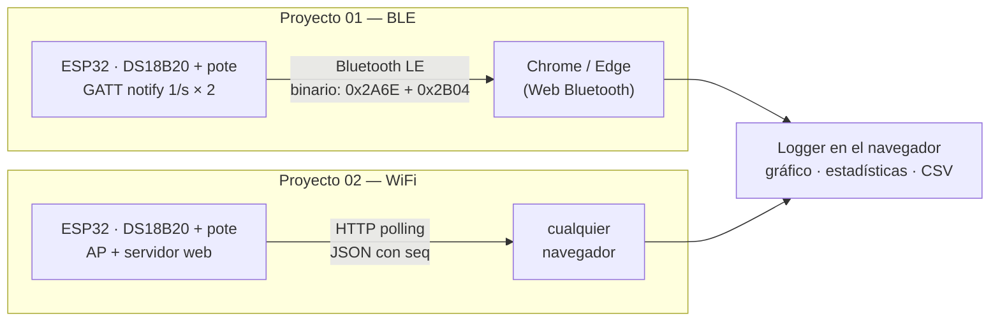

# 📡 Datalogger Web ESP32 — 2026

**Materia:** EL831 Instrumentación Electrónica | **Año:** 2026

Dos **registradores de datos** (dataloggers) de **dos canales** donde el
navegador es el instrumento de registro: los mismos sensores (temperatura
con un DS18B20 y posición con un potenciómetro) y la misma app web, con dos
enlaces inalámbricos distintos — **Bluetooth Low Energy** y **WiFi**.
Sin instalar nada: el "software de adquisición" es una página.

Continúa el enfoque de [LabVIEW-ESP32-2026](https://github.com/fernandorvs/LabVIEW-ESP32-2026):
**la medición no cambia, cambia el enlace** — y acá además cambia quién
registra: el logger vive en el navegador (RAM + exportación CSV).

## 🚀 App en vivo

- **Logger BLE**: https://fernandorvs.github.io/Datalogger-Web-ESP32-2026/
  (Chrome/Edge; con un ESP32 corriendo `01-ble` cerca, botón *Conectar*).
- **Sin hardware**: agregar [`?demo=1`](https://fernandorvs.github.io/Datalogger-Web-ESP32-2026/?demo=1)
  — datos simulados para conocer la interfaz.
- **Logger WiFi**: no tiene URL pública a propósito — la sirve el propio
  ESP32 en `http://192.168.4.1` (ver `02-wifi/`).

## 🗺️ Panorama

## 🔬 Dónde está la instrumentación (para que no se pierda el foco)

- **¿Quién pone el timestamp?** El ESP32 no tiene reloj de tiempo real: la
  hora la pone el navegador *al llegar* cada dato. El jitter del enlace
  queda impreso en el registro — medirlo es un ejercicio en sí.
- **¿Se perdieron muestras?** En WiFi el campo `seq` delata los huecos; en
  BLE, ¿cómo lo detectarías? (no hay `seq`… ¿debería haberlo?).
- **¿Dónde se registra?** Acá, en el navegador. ¿Qué se gana y qué se
  pierde contra registrar en el ESP32 (tarjeta SD) o en un servidor?
- **¿Texto o binario?** El BLE manda un `sint16` en centésimas de grado
  según una especificación pública (Bluetooth SIG); el WiFi manda JSON
  legible. Mismo dato, dos filosofías de formato.
- **¿Digital o analógico?** El mismo logger registra un canal digital (el
  DS18B20 entrega el número ya hecho) y uno analógico (el potenciómetro por
  el ADC: divisor resistivo, ruido, promediado). Compararlos en el mismo
  CSV es la mitad de la clase.

## ⚖️ Comparativa (la tabla que hay que poder defender en el oral)

| | 01 · Bluetooth LE | 02 · WiFi (Access Point) |
|---|---|---|
| Topología | punto a punto (un solo cliente) | red propia, varios clientes a la vez |
| ¿Quién inicia? | el navegador (elige el dispositivo) | el navegador (pide por HTTP) |
| Entrega del dato | *push* (notificación) | *pull* (polling 1/s) |
| Formato | binario con especificación (0x2A6E) | texto JSON autodescriptivo |
| Alcance típico | ~10 m | ~30–50 m |
| Consumo del ESP32 | muy bajo | medio/alto |
| Navegadores | Chrome/Edge en PC y Android — **no iOS** | todos |
| Infraestructura | la app vive en internet (GitHub Pages, HTTPS) | ninguna: el instrumento sirve su propia app |

## 📚 Contenido

### 📘 [01 — Logger BLE (Web Bluetooth)](01-ble/)
El ESP32 publica los dos canales con el servicio estándar *Environmental
Sensing* — una característica por canal (0x2A6E temperatura, 0x2B04
porcentaje) — y la app (esta misma página de Pages) se suscribe a las
notificaciones desde el navegador.

### 📗 [02 — Logger WiFi (el instrumento es el servidor)](02-wifi/)
El ESP32 crea su propia red WiFi y sirve la app en `http://192.168.4.1`;
la página hace polling del JSON con `seq` y los dos canales, como la capa 4
de LabVIEW.

Cada carpeta tiene el proyecto **PlatformIO** del ESP32 y un README con
teoría mínima, cableado y los pasos de uso. La app es HTML/JS puro, sin
frameworks ni dependencias: se puede leer entera en una clase.

## 🧰 Requisitos

- **Chrome o Edge** (solo para el proyecto BLE; el WiFi anda en cualquiera).
- **VS Code + PlatformIO** — abrir `workspace.code-workspace`.
- Un **ESP32**, un **DS18B20** con pull-up de 4,7 kΩ (kit del curso de
  IoT) y un **potenciómetro** de ~10 kΩ — o el modo `SIMULAR` del firmware
  y el `?demo=1` de la app, sin hardware.

## 📲 Instalar como app (acceso directo)

Las dos apps se agregan a la pantalla de inicio / escritorio con su propio
ícono — pero **no igual**, y la diferencia es una clase entera:

- **Logger BLE** (HTTPS en Pages) es una **PWA instalable de verdad**: en
  Chrome/Edge de PC, el ícono de instalar (⊕) en la barra de direcciones o
  menú ⋮ → *Instalar app*; en Android, menú ⋮ → *Agregar a pantalla
  principal* → *Instalar*. Queda con ventana propia y, gracias al service
  worker (`docs/sw.js`), **abre incluso sin internet**.
- **Logger WiFi** (HTTP en el ESP32) solo admite **acceso directo**: en
  Android, menú ⋮ → *Agregar a pantalla principal* (toma nombre e ícono del
  manifest que sirve el propio ESP32). La instalación completa exige
  **contexto seguro (HTTPS)** — el mismo límite que ya apareció con Web
  Bluetooth y con *mixed content*. Tercera vez que aparece: ya es un tema
  del curso.

## 🌐 Publicar la app (una sola vez, el dueño del repo)

GitHub → **Settings → Pages → Build and deployment**: *Deploy from a
branch*, rama `main`, carpeta `/docs`. En un minuto la app queda en
`https://<usuario>.github.io/Datalogger-Web-ESP32-2026/`.

---

**EL831 Instrumentación Electrónica · 2026**
