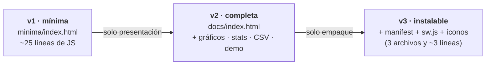

# Apéndice — La app web, de 0 a instalable

Cómo está hecha la página del logger, en capas: una **versión mínima** que
se puede escribir desde cero en una clase, la **app completa** con gráficos
y CSV, y la **versión instalable** (PWA). Al final: cómo **publicar tu
propia copia** — en tu máquina, gratis en internet, o con dominio propio.

La observación que ordena todo: la app es **100 % estática**. No hay código
en ningún servidor — todo (protocolo, gráficos, registro, exportación) corre
en el navegador. "Hostear" la app es solo *servir archivos*: por eso es
gratis o casi, y por eso se puede entender entera.



El protocolo es el mismo en las tres: **las ~20 líneas de la v1 no cambian
nunca más**. Lo que se agrega después es presentación y empaque.

---

## 🧪 Versión 1 — mínima ([`minima/index.html`](minima/index.html))

Un botón, dos renglones de texto y el protocolo completo: `requestDevice`
con filtro por el servicio 0x181A, `connect`, una suscripción por
característica (0x2A6E temperatura, 0x2B04 pote) y la decodificación de los
bytes. Sin CSS, sin gráficos, sin manejo de errores — **a propósito**: cabe
en una pantalla y se escribe desde cero siguiendo los comentarios.

Lo que quedó afuera (y la v2 agrega): reconexión y estados de error, el
registro en RAM con timestamp, los gráficos, las estadísticas, el CSV y el
modo demo.

### Por qué no abre con doble click

Web Bluetooth solo corre en **contexto seguro**. Abrir el archivo con doble
click lo carga como `file://` — y eso **no** es contexto seguro, así que
`navigator.bluetooth` ni existe. Pero hay una excepción clave:
**`http://localhost` SÍ es contexto seguro**. O sea: para desarrollar en tu
máquina **no hace falta HTTPS** — solo hace falta *servir* la carpeta y
entrar por `localhost`.

### Servirla — opción A: VS Code (ya lo tenés)

Si ya usás VS Code con PlatformIO, no hay que instalar nada más: extensión
**Live Server** (Ritwick Dey) → abrir la carpeta `minima/` → botón **Go
Live** (abajo a la derecha) → se abre `http://127.0.0.1:5500`. Listo.

### Servirla — opción B: Python

Python trae un servidor de archivos incorporado. En una terminal, **parado
en la carpeta `minima/`**:

```bash
python -m http.server 8000
```

y abrir **http://localhost:8000** en Chrome o Edge. (Ctrl+C lo detiene.)

### ¿No tenés Python? Instalarlo lleva 5 minutos

Primero fijate si ya está — en una terminal:

```bash
python --version      # Windows (también probar:  py --version)
python3 --version     # macOS / Linux
```

Si contesta `Python 3.x.x`, ya está. Si no:

- **Windows**: bajar el instalador de [python.org/downloads](https://www.python.org/downloads/)
  y — **el paso que todos saltean** — tildar **"Add python.exe to PATH"** en
  la primera pantalla antes de *Install Now*. Alternativa: instalar
  "Python 3" desde Microsoft Store (el PATH queda solo). Después, en una
  terminal *nueva*: `python -m http.server 8000` (o `py -m http.server 8000`).
- **macOS**: ya viene `python3` (al primer uso ofrece instalar las
  *Command Line Tools*: aceptar). Usar `python3 -m http.server 8000`.
- **Linux**: ya viene. `python3 -m http.server 8000`.

> ⚠️ Ojo PlatformIO: PlatformIO instala *su propio* Python interno, que no
> queda en el PATH — por eso podés compilar firmware y aun así no tener
> `python` en la terminal. Son independientes.

### Probarla

Con un ESP32 corriendo el firmware de [`01-ble/`](../01-ble/) cerca (sirve
el modo `SIMULAR = true`, sin sensores): **Conectar por Bluetooth** → elegir
el dispositivo → los dos números se actualizan solos, uno por segundo. Eso
es todo el logger — lo demás es decoración.

---

## 📈 Versión 2 — la app completa ([`docs/index.html`](../docs/index.html))

Es **un solo archivo** sin frameworks ni librerías — se lee de punta a
punta. El tour, bloque por bloque (los títulos son los comentarios
`/* ---------- */` del propio archivo):

| Bloque | Qué hace | La idea |
|---|---|---|
| `utilidades` | `$()`, formato de números | azúcar, nada más |
| `registro` | `agregarMuestra()`, `actualizarUI()` | **el logger en serio**: un array en RAM; el navegador pone el timestamp al llegar cada dato |
| `gráficos` | `crearGrafico(cfg)` | canvas puro: una fábrica, dos instancias (temp y pote) — un gráfico por magnitud, nunca doble eje |
| `estado` | `estado(clase, texto)` | la barra Conectado / Desconectado / DEMO |
| `CSV / borrar` | `btnCsv.onclick` | arma el texto y lo descarga con un `Blob` — exportar son 10 líneas |
| `conexión BLE` | `conectar()` | **las mismas ~20 líneas de la v1**, más: estados, `gattserverdisconnected`, y el detalle del par (abajo) |
| `modo demo` | `?demo=1` | datos sintéticos para probar la interfaz sin hardware |

El único refinamiento de protocolo respecto de la v1: el firmware notifica
el pote *primero* y la temperatura *después*, así que `conectar()` guarda el
pote en `ultimoPote` y **registra el par completo al llegar la
temperatura** — una decisión de instrumentación (¿cuándo está "completa" una
muestra multicanal?) escondida en 3 líneas.

Ejercicio de lectura recomendado: abrir la v1 y la función `conectar()` de
la v2 lado a lado — son el mismo código con camperita.

---

## 📲 Versión 3 — instalable (PWA)

La diferencia entre "una página" y "una app con ícono que abre sin
internet" son **tres archivos y tres líneas**. Todo está en
[`docs/`](../docs/):

1. **[`manifest.webmanifest`](../docs/manifest.webmanifest)** — la "ficha
   técnica": nombre, íconos, colores, y `display: standalone` (ventana
   propia, sin barra del navegador). Se declara con una línea en el
   `<head>`: `<link rel="manifest" href="manifest.webmanifest">`.
2. **Íconos** (`icons/icono-192.png`, `icono-512.png`) — los tamaños que
   Android y el escritorio piden; el 512 repetido como `maskable` para que
   Android lo recorte en círculo sin cortar el dibujo.
3. **[`sw.js`](../docs/sw.js)** — el *service worker*, 37 líneas:
   intercepta cada `fetch` con estrategia **red primero** (si hay internet,
   versión fresca) **y caché de respaldo** (si no hay, lo último que se
   vio). Por eso la app instalada abre en el medio del campo — y como el
   Bluetooth es local, el logger **funciona completo sin red**.

El registro, al final de `index.html`:

```js
if ('serviceWorker' in navigator && location.protocol === 'https:') {
  navigator.serviceWorker.register('sw.js').catch(() => {});
}
```

Y acá el límite que ya es tema del curso: **instalar exige HTTPS** (contexto
seguro, otra vez — el guard de arriba lo hace explícito). Por eso la app
BLE en Pages es instalable y la del proyecto 02, servida por HTTP desde el
ESP32, solo llega a acceso directo.

---

## 🌐 Publicar tu propia copia

La escalera, de más cerca a más lejos:

| Escalón | Cómo | ¿Contexto seguro? | Costo |
|---|---|---|---|
| **Tu máquina** | Live Server o `python -m http.server` → `localhost` | ✅ (excepción localhost) | — |
| **Tu celular, demo rápida** | túnel: un comando te da una URL `https://` pública temporal | ✅ | — |
| **Internet, gratis** | **GitHub Pages** (lo que usa este repo) · Netlify Drop · Cloudflare Pages | ✅ | — |
| **Dominio propio** | un dominio (~USD 10–15/año) + cualquier hosting estático | ✅ | $ |

- **La trampa del celular por LAN**: `http.server` también atiende en
  `http://192.168.x.x:8000` — el celular carga la página… y Web Bluetooth
  no aparece: por IP no hay excepción de contexto seguro. Salidas: un
  **túnel** (`npx localtunnel --port 8000`, o ngrok / cloudflared — un
  comando, URL `https://` al instante) o el **port forwarding** de Chrome
  por USB (`chrome://inspect` → *Port forwarding*), que hace que
  `localhost:8000` *del celular* sea tu PC.
- **GitHub Pages, el camino del curso**: hacer un **fork** de este repo →
  *Settings → Pages* → *Deploy from a branch*, rama `main`, carpeta
  `/docs` → en un minuto tu copia vive en
  `https://TU-USUARIO.github.io/Datalogger-Web-ESP32-2026/`. Cada push a
  `docs/` republica solo. (Sin repo: **Netlify Drop** es arrastrar la
  carpeta a [app.netlify.com/drop](https://app.netlify.com/drop) y ya hay
  URL.)
- **¿Y lo pago qué compra?** El **nombre**, no la seguridad: el HTTPS hoy es
  gratis en todos lados (Let's Encrypt). Un dominio propio + el mismo
  hosting estático gratuito es la configuración típica de un instrumento
  comercial chico.

---

## ✏️ Ejercicios

1. Escribir la v1 desde cero (sin copiar y pegar) y hacerla andar contra el
   firmware en modo `SIMULAR`.
2. Agregarle a la v1 el **nombre del dispositivo** y un aviso cuando se
   desconecta (`gattserverdisconnected` — espiar la v2).
3. En la v2: cambiar el color de una serie, o el largo de la ventana de los
   gráficos. Un solo archivo: buscar, tocar, recargar.
4. Publicar tu fork en GitHub Pages y pasarle la URL a un compañero — su
   celular, tu ESP32.
5. (Para discutir) ¿Qué habría que cambiar para que la app registre también
   con la pestaña en segundo plano? ¿Y para que dos navegadores vean el
   mismo registro? — ahí empiezan los servidores de verdad.

---

**EL831 Instrumentación Electrónica · 2026**
